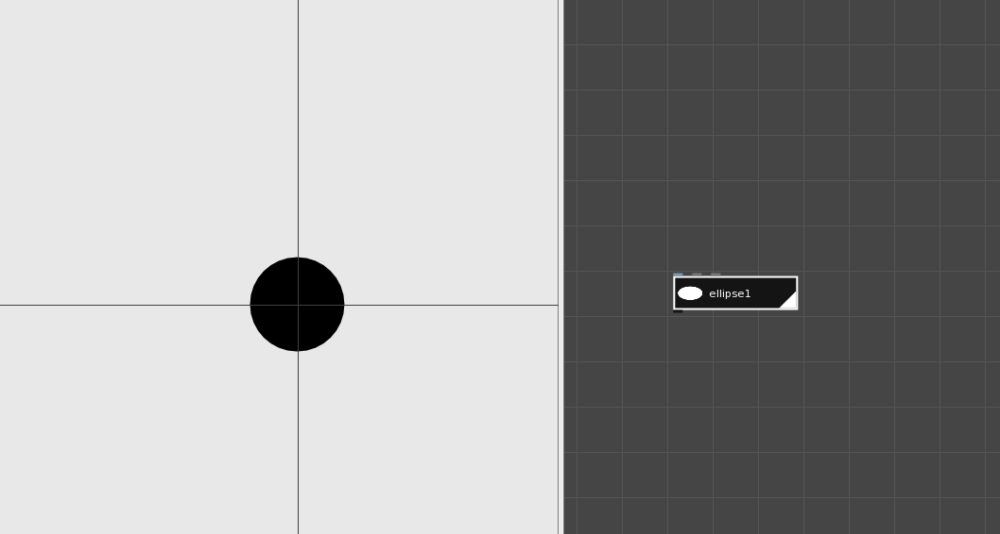
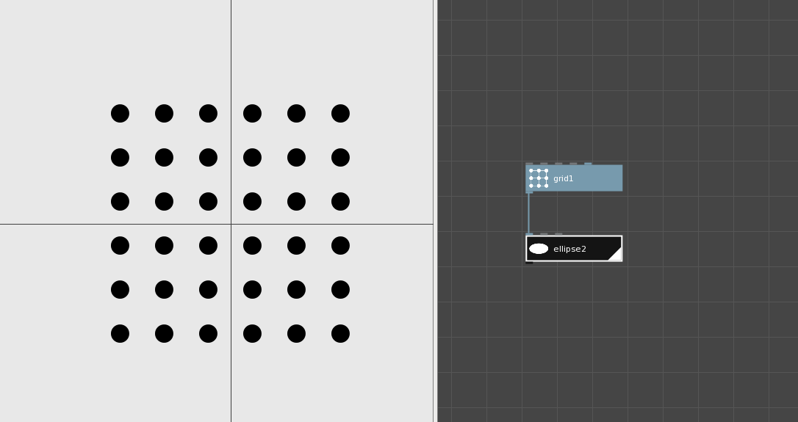
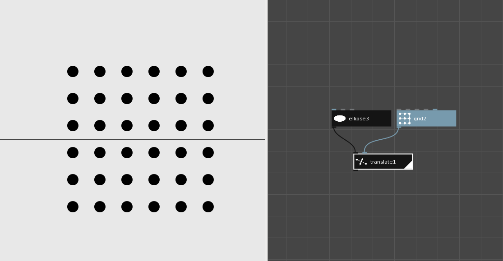
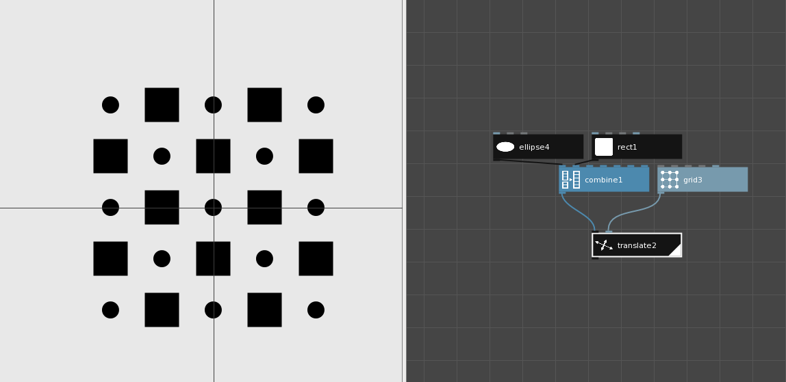

=====================
NodeBox Architecture
=====================

https://www.nodebox.net/node/documentation/concepts/concepts.html

Every NodeBox document consists of a computation engine and a rendering engine.

The node graph that we create is used by the computation engine to execute the graph and create the scene graph. Then the rendering engine will display the scene in the viewer.

+++++++++++++++
Rendering Engine
+++++++++++++++

.. code::
  
  for shape in scene.shapes:
      shape.draw()

++++++++++++++++++++
Example 1
++++++++++++++++++++

.. code::

    position = [(x, y)]
    width = [25]
    height = [25]

    scene.add(ellipse(x, y, 25, 25))

++++++++++++++++++++
Example 2
++++++++++++++++++++

.. code::

    positions = [point1, point2, ..., point36] <= grid1.points
           width = 25
           height = 25  
    for position in positions:
               shape = ellipse(position.x, position.y, width, height)
               scene.add(shape)

    len(scene.shapes) == 36

++++++++++++++++++++
Example 3
++++++++++++++++++++

.. code::

    shape = ellipse3.output
    translate = [point1, point2, ..., point36]

    for translation in translate:
        new_shape = shape.clone()
        new_shape.position = translation
        scene.add(new_shape)

    len(scene.shapes) == 36

++++++++++++++++++++
Example 4
++++++++++++++++++++

.. code::

    shapes = [ellipse(0, 0, 25, 25), rect(0, 0, 50, 50, 0, 0)] <= combine1.output
    translate = [point1, point2, ..., point36] <= grid3.output

    num_shapes = len(shapes)

    for index, translation in enumerate(translate):
        new_shape = shapes[index%num_shapes].clone()
        new_shape.position = translation
        scene.add(new_shape)

    len(scene.shapes) == 36
